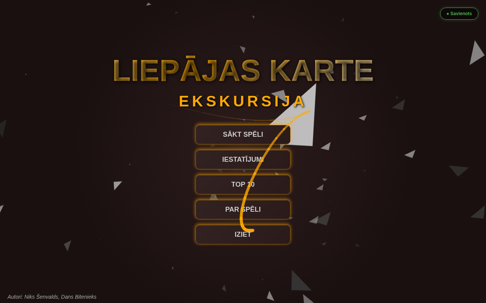
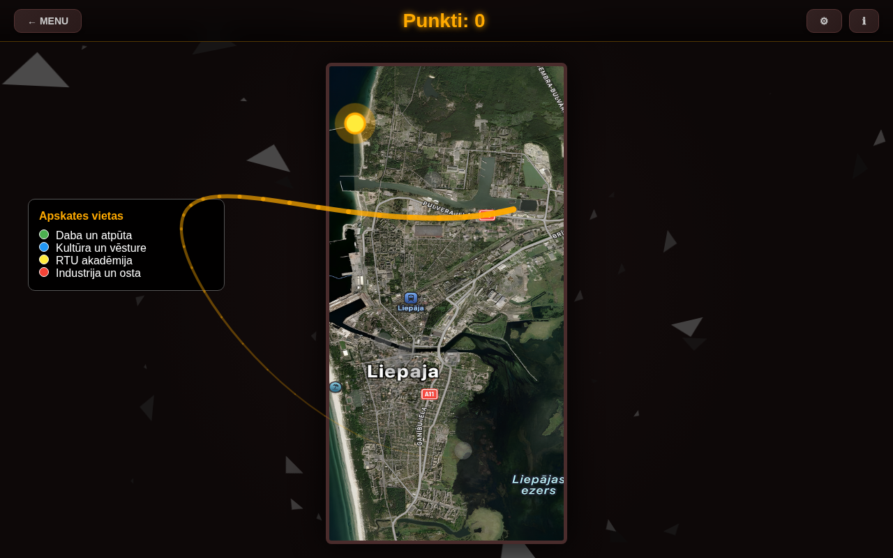
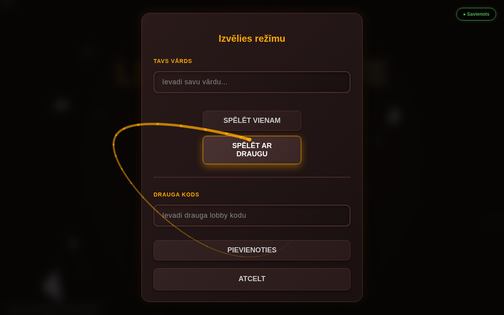
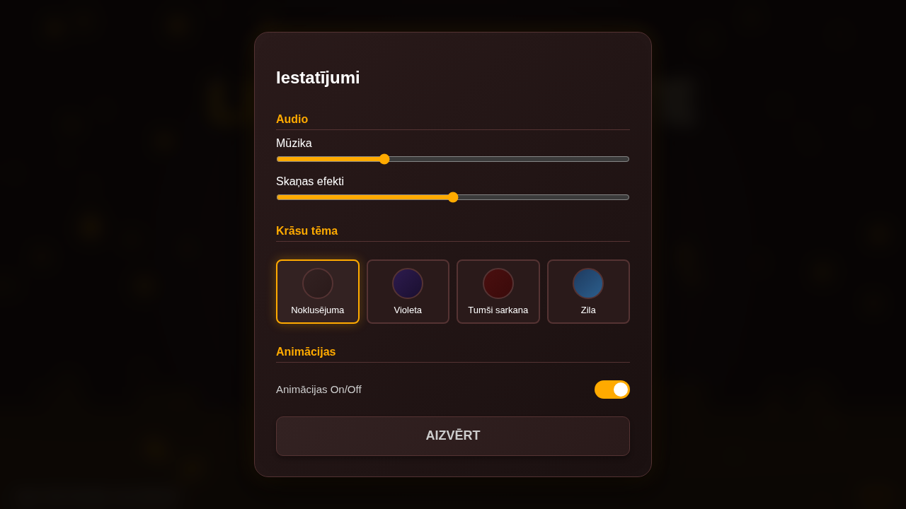

# Macību ekskursija Liepājā

Interaktīva tīmekļa spēle par Liepājas kultūrvēsturiskajām vietām. Izpēti 10 apmeklējuma punktus kartē, atbildi uz jautājumiem un sacenšoties par vietu Top 10!

**Autori:** Niks Šenvalds, Dans Bitenieks (Grupa 2PT)

---

## Ekrānuzņēmumi

| Galvenā izvēlne | Karte |
|---|---|
|  |  |

| Spēles režīms | Iestatījumi |
|---|---|
|  |  |

---

## Spēles noteikumi

1. Apmeklē **10 vietas** Liepājā noteiktā secībā.
2. Katrā vietā saņem informāciju un **uzdevumu** (jautājums, mini-spēle vai secības uzdevums).
3. **Punkti:** pareiza atbilde 1. mēģinājumā → **+10 pkt**, pēc kļūdas → **+5 pkt**, 2 kļūdas → **0 pkt** (atbilde parādās automātiski).
4. **Noslēguma tests:** 5 jautājumi par Liepāju (katra pareiza atbilde: +2 bonusa punkti, maks. +10).
5. Maksimālais rezultāts: **110 punkti**. Saglabā rezultātu un iekļūsti **Top 10**!

---

## Galvenās funkcijas

- **Viena spēlētāja** un **multiplayer** režīms (reālā laika co-op ar draugu)
- **Mini-spēles:** laivas sacīkstes, kukaiņu ķeršana, vēstures secības kārtošana
- **Flash viktorīna** (≥3 spēlētāji, 20s limits) ar kopīgiem bonusa punktiem
- **4 krāsu tēmas**, animēts daļiņu fons, mūzikas/SFX iestatījumi
- **Top 10 tabula** ar kombinētu punktu + laika vērtējumu
- **Anti-cheat** un **admin panelis** jautājumu maiņai un spēlētāju pārvaldībai

---

## Tehnoloģijas

| Slānis | Rīki |
|--------|------|
| Frontend | React, Vite, HTML, CSS, JavaScript, Bootstrap 5.3.2 |
| Spēļu dzinējs | Phaser 3 (mini-spēles) |
| Backend | Node.js + PHP (leaderboard, multiplayer lobby) |
| Real-time | Socket.IO 4.8 + raw WebSocket |
| Datubāze | Supabase (PostgreSQL) |

---

## Struktūra

```
Ekskursija-Liepaja/
├── index.html / map.html          # Galvenā izvēlne un karte
├── style.css                      # Globālie stili
├── atteli/ / skana/               # Attēli un audio
├── src/
│   ├── js/script.js               # Spēles loģika 
│   ├── js/server.js               # Socket.IO + raw WS serveris
│   ├── php/                       # Backend (leaderboard, lobby, anti-cheat)
│   └── data/                      # JSON dati (jautājumi, atbildes, lobbies)
├── client/                        # React + Phaser — viena spēlētāja režīms
└── game/                          # React + Phaser — multiplayer režīms
    └── src/utils/SocketManager.js  # Socket.IO klients
```
---

## Resursi

- **Karte:** https://maps.apple.com/
- **Gida attēls (Kaija):** Autoru zīmējums (https://www.aseprite.org/)
- **Informācija:** liepaja.lv, rtu.lv, Liepājas muzejs, wikipedia.org
- **Audio:** https://pixabay.com/

---

© 2026 Niks Šenvalds, Dans Bitenieks — izglītības projekts.
