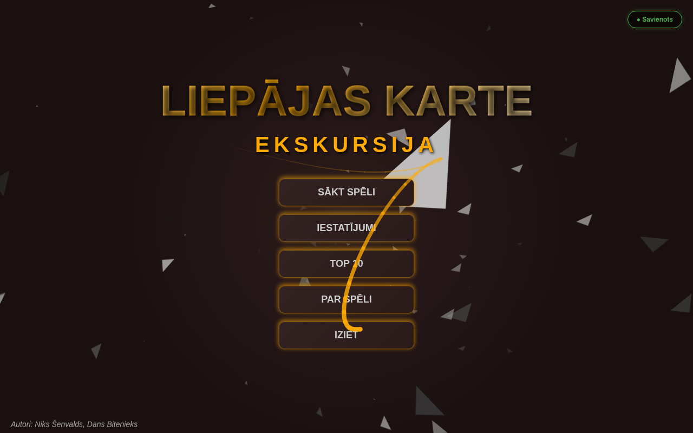
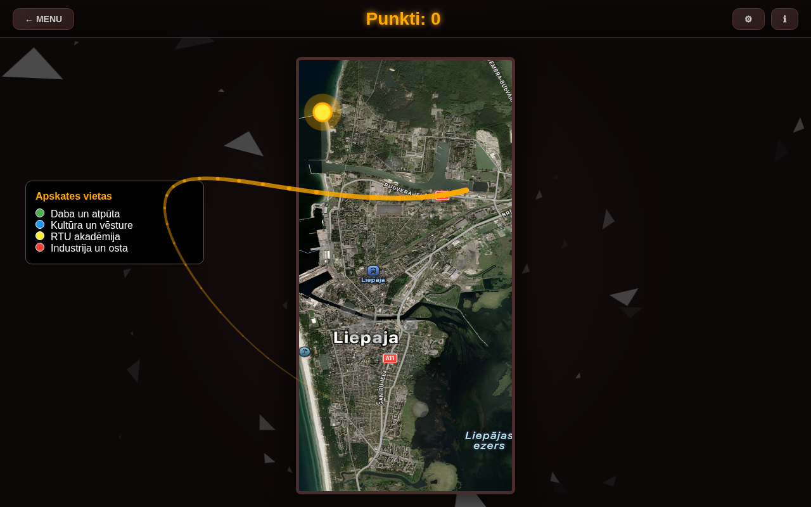
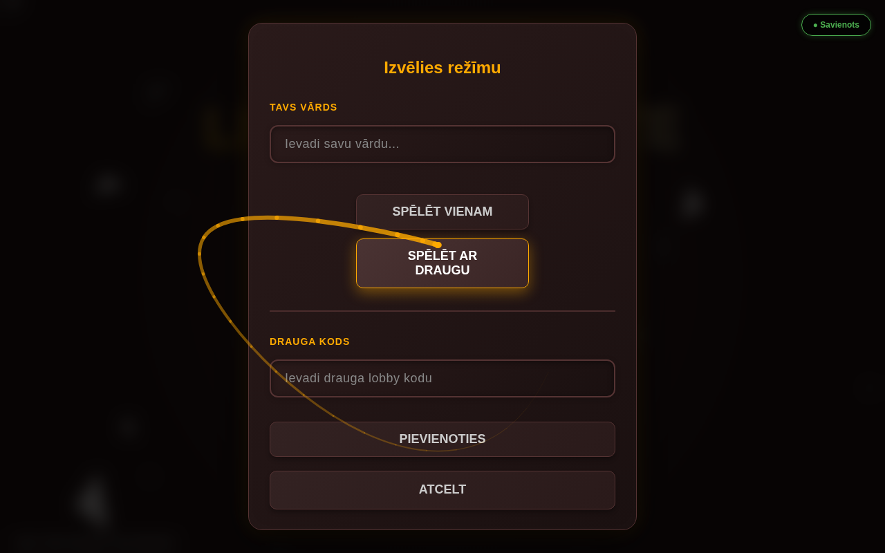
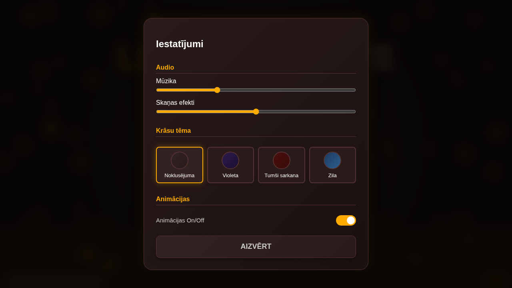

# Mācību ekskursija Liepājā
### Izglītojoša interaktīva tīmekļa spēle

Projekts izstrādāts konkursam  
**"Spēļu laboratorija" — Liepājas Datorzinātņu olimpiāde 2026**

**Autori:** Niks Šenvalds, Dans Bitenieks (Grupa Pilsētas puika)

---

## Projekta ideja

"Mācību ekskursija Liepājā" ir interaktīva tīmekļa spēle, kurā spēlētājs dodas virtuālā ekskursijā pa Liepāju, apmeklējot dažādas pilsētas vietas un izpildot izglītojošas aktivitātes.

Spēle apvieno:
- pilsētas iepazīšanu,
- zināšanu pārbaudi,
- mini-spēles,
- progresijas sistēmu,
- punktu uzskaiti.

Mērķis — padarīt mācīšanos par Liepāju interaktīvu un saistošu.

---

## Ekrānuzņēmumi

| Galvenā izvēlne | Karte |
|---|---|
|  |  |

| Spēles režīms | Iestatījumi |
|---|---|
|  |  |

---

## Spēles mērķis

Spēlētājam jāiziet pilna ekskursija:

1. Apmeklēt Liepājas objektus kartē
2. Iepazīt katras vietas informāciju
3. Izpildīt aktivitāti vai mini-spēli
4. Krāt punktus
5. Pabeigt noslēguma pārbaudījumu
6. Saņemt gala rezultātu

---

## Spēles struktūra

Spēle sastāv no:
- titullapas ar navigāciju,
- spēles apraksta sadaļas,
- interaktīvas Liepājas kartes,
- vismaz 10 apmeklējuma vietām,
- aktivitātēm un mini-spēlēm,
- punktu sistēmas,
- noslēguma testa,
- gala rezultāta ekrāna,
- Top 10 rezultātu tabulas.

---

## Atbilstība nolikumam

### Obligātās funkcijas

Projektā realizēts:

- Titullogs ar navigāciju
- Spēles noteikumu sadaļa
- Vismaz 10 apmeklējuma vietas kartē
- Informācija par katru objektu
- Aktivitāte katrā vietā
- Punktu uzskaites sistēma
- Punktu samazināšana kļūdu gadījumā
- Katru vietu iespējams apmeklēt vienu reizi
- Datu ielāde no ārējiem JSON failiem
- Noslēguma aktivitāte (tests)
- Gala rezultāta aprēķins un attēlošana

### Papildu funkcionalitāte

Papildus realizēts:

- Interaktīva karte ar progresijas sistēmu
- Phaser.js mini-spēles
- Nejauši ģenerēts maršruts katrai spēlei
- Spēlē pavadītā laika uzskaite
- Rezultātu saglabāšana serverī
- Top 10 rezultātu tabula
- Multiplayer režīma pamati
- Skaņas un iestatījumu sistēma
- Responsīvs dizains dažādām ierīcēm

Piezīme: multiplayer režīms var būt nestabils dažādās hostinga vidēs.

---

## Aktivitāšu veidi

Spēlē iekļauti dažādi uzdevumu tipi:
- zināšanu testi,
- reakcijas mini-spēles,
- loģikas uzdevumi,
- interaktīvas aktivitātes,
- izglītojoši fakti par Liepāju.

Katrs objekts piedāvā unikālu pieredzi.

---

## Punktu sistēma

- Punkti tiek piešķirti par veiksmīgi izpildītiem uzdevumiem.
- Kļūdaini mēģinājumi samazina maksimāli iegūstamos punktus.
- Uzdevumus iespējams atkārtot ar ierobežotu rezultātu.
- Gala rezultāts tiek aprēķināts ekskursijas beigās.

---

## Izmantotās tehnoloģijas

| Slānis | Tehnoloģijas |
|--------|--------------|
| Frontend | HTML5, CSS3, JavaScript |
| Spēļu dzinējs | Phaser 3 |
| Backend | PHP |
| Multiplayer | Node.js / WebSocket |
| Datu struktūra | JSON |
| Versiju kontrole | Git |

---

## Projekta struktūra

```
Ekskursija-Liepaja/
├── atteli/            # Attēli (ikonas, spēles grafika, UI elementi)
├── skana/             # Skaņas faili (mūzika, skaņas efekti)
├── game/              # Spēles loģika un aktivitāšu faili
├── src/               # Avota skripti (JavaScript / backend vai palīgmoduļi)
├── db/                # Datu faili (jautājumi, konfigurācijas, dati u.c.)
├── client/            # Node.js / WebSocket klienta vai servera loģika
├── docs/              # Projekta dokumentācija un papildu materiāli
├── index.html         # Sākuma lapa / galvenā izvēlne
├── map.html           # Kartes skats / ekskursijas interfeiss
├── style.css          # Galvenie stili (CSS)
├── package.json       # NPM konfigurācija un atkarības
├── package-lock.json  # Precīzas NPM versijas
├── .htaccess          # Servera konfigurācija (Apache)
├── .gitignore         # Git ignorētie faili
└── README.md          # Projekta apraksts
```

## Kā palaist projektu

### Drošības konfigurācija

Servera noslēpumus glabā tikai vides mainīgajos, nevis repozitorijā:

```text
PORT=8080
ALLOWED_ORIGINS=https://kristovskis.lv,http://localhost:3000
ADMIN_PASSWORD_HASH=scrypt$<salt>$<derived-key>
SUPABASE_URL=https://<project>.supabase.co
SUPABASE_SERVICE_ROLE_KEY=<server-only-key>
```

PHP admin panelim Apache/PHP vidē jāiestata `ADMIN_PASSWORD_HASH` ar
`password_hash()` ģenerētu vērtību. Node hash ģenerē ar
`node -e "console.log(require('./src/js/security').hashAdminPassword('...'))"`.
`game/admin.html` izsniedz 15 minūšu HttpOnly sesijas cookie; admin parole
nekad nenonāk pārlūka bundle. Nekad nepublicē `.env`, service-role atslēgas vai
datu failus.

### Product decisions and deployment model

- The supported game languages are Latvian, English, and Russian. The language
  picker stores the anonymous player's preference locally.
- Multiplayer and offline play are required features. The client keeps progress
  locally and reconnects to the Node Socket.IO service when available.
- Players can start anonymously. Leaderboard publishing remains optional and
  should be presented as the incentive to create an account; account identity
  must never be required to play.
- Node.js is the canonical realtime/API layer. PHP endpoints remain as a
  compatibility adapter for existing Apache hosting and should not become a
  second source of game truth.
- The admin UI is not linked from the public game. Deploy `game/admin.html` as
  a separate protected entry using the `/admin` Socket.IO namespace and a
  server-issued short-lived HttpOnly admin session; never ship an admin
  secret in a public Vite bundle.
- Leaderboard names are validated server-side and rejected when they contain
  slurs, markup, control characters, or unsupported length. Public display is
  the default, with moderation and deletion available to administrators.

For a Node deployment, run the root server and serve `game/dist-game` behind
HTTPS. For Apache/PHP hosting, serve the existing PHP adapter and static build,
and reverse-proxy `/socket.io` and `/api` to the Node process. In both modes,
the Node service and database are authoritative for authenticated game results.

### Ātra uzstādīšana un struktūra

Prasības: Node.js 20+, npm, PHP 8+ (legacy adapterim), Apache ar
`mod_headers` (ja PHP tiek lietots), un Supabase/PostgreSQL produkcijas
datubāzei. No repozitorijas saknes:

```bash
npm run setup
npm run dev
npm --prefix game run dev
```

`game/` ir kanoniska React/Phaser spēle, `src/js/` ir kanoniska Node
reāllaika/API autoritāte, `src/php/` ir Apache saderības adapteris, bet
`client/`, saknes HTML un `dist*/` ir legacy/build varianti. Jaunu kodu liek
`game/` + Node servisā; PHP/legacy maina tikai saderībai. `db/schema.sql`
jāpalaiž Supabase SQL editorā. Service-role atslēga drīkst būt tikai Node
procesa vidē.

CI palaiž Node testus, ESLint, Prettier, `npm audit`, abus Vite buildus un
Gitleaks secret scan. Phaser ainas tiek lazy-loadotas tikai mini-spēles
atvēršanas brīdī; lieliem attēliem izmanto WebP/AVIF un `loading="lazy"`,
audio — saspiestu OGG/MP3 ar lietotāja skaņas/klusuma iestatījumu.

### Tiešsaistē (ieteicamais variants)

Spēle pieejama:

kristovskis.lv/senvalds-bitenieks/
---

### Lokāli (izstrādei)

Nepieciešams:
- PHP serveris (XAMPP vai līdzīgs)
- Node.js (multiplayer funkcijai)

1. Ievieto projektu servera mapē (piemēram `htdocs`)
2. Palaid PHP serveri
3. Atver pārlūkā:
http://localhost/Ekskursija-Liepaja/public/
4. Multiplayer režīmam (neobligāti):
node ws-server/server.js

---

## Izmantotie avoti

### Informācijas avoti

- Liepājas oficiālā mājaslapa — https://www.liepaja.lv/
- RTU Liepājas akadēmija — https://www.rtu.lv/
- Liepājas muzejs — https://www.liepajasmuzejs.lv/
- Wikipedia — https://www.wikipedia.org/

---

### Kartes un ģeogrāfiskie dati

- Apple Maps — https://maps.apple.com/

---

### Audio resursi

- Pixabay Audio Library — https://pixabay.com/sound-effects/

---

### Grafiskie resursi

- Gida tēls (“Kaija”) — autoru veidots attēls  
  Izstrādāts ar LibreSprite: https://libresprite.github.io/

- Spēles interfeisa grafika — autoru izstrādāta.

---

### Programmatūra un bibliotēkas

- Phaser 3 — https://phaser.io/
- Node.js — https://nodejs.org/
- WebSocket API — https://developer.mozilla.org/
- PHP — https://www.php.net/
- Git — https://git-scm.com/
- AI — [Gemini](https://gemini.google.com/app), [Claude](https://claude.ai/), [Codex](https://chatgpt.com/codex). 

Izmantotas spēles loģikas, mini-spēļu un multiplayer funkcionalitātes realizācijai.

---

© 2026 Niks Šenvalds, Dans Bitenieks
